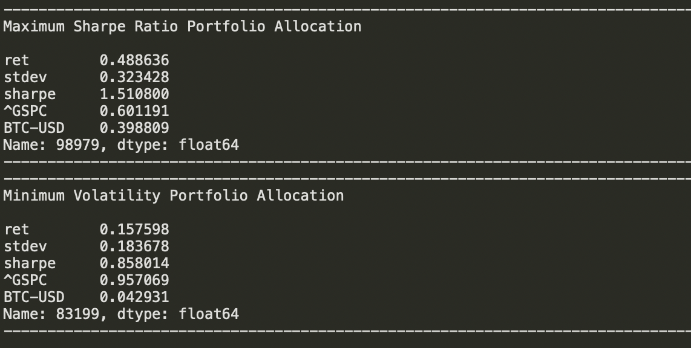
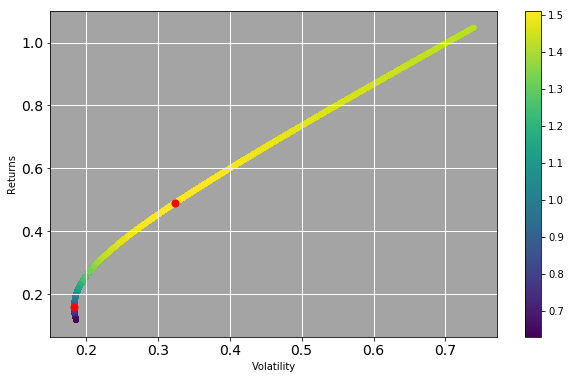

# Bitcoin Efficient Frontier: Using Bitcoin to reduce overall portfolio risk ? 

The Efficient Frontier concept has its roots in the 1950s, and it’s a pillar of Modern Portfolio Theory and Capital Asset Pricing Model (CAPM).  
It was developed by Nobel-prize winner Harry Max Markowitz. When Markowitz introduced the efficient frontier, it was groundbreaking in many respects. One of its largest contributions was its clear demonstration of the power of diversification.

One assumption in investing is that a higher degree of risk means a higher potential return.  
While this is mostly true for individual assets, this assumption doesn’t hold true when looking at an investment portfolio as a whole.  
According to Markowitz's theory, there is an optimal portfolio that could be designed with a perfect balance between risk and return.  
The theory relies on the assumption that investors prefer portfolios that generate the most substantial possible return with the least amount of involved risk.
We refer to these as optimal portfolios, and they form the efficient frontier curve.  

For this model, we consider the standard deviation of the return on the asset as its risk measure and the compounded annual growth rate is a common choice for the return component.  
The relationship between assets is an essential part of the optimal portfolio theory. Some prices move in the same direction under similar circumstances, while others go in opposite directions.
The more out of sync these price developments are, the lower the covariance between two assets is, which translates into lower overall risk.  

The curve is essential in showing how diversification improves the risk/reward profile for the investor. It proves that the relation between risk and return is non-linear.
There is a diminishing marginal return to risk; adding more risk does not gain an equal return.  
Instead, each additional unit of risk adds a smaller and smaller amount of return to the portfolio.  

# Assumptions and Limitations  
The theory behind the Efficient Frontier relies heavily on some assumptions, not all of which represent reality. The underlying assumptions for the optimal portfolio are focused primarily on the investors:  
-	We expect investors to be rational and all have access to the same information
-	They are all risk-averse and share the goal to maximize returns
-	No single investor can influence the market
-	All market players have access to unlimited funds at a risk-free rate
-	We assume that asset returns follow a normal distribution
-	Investors base all decisions on the market on expected returns and standard deviation as a measure of risk.

# How does Bitcoin affect the return and risk of an investment portfolio ?  
Due to the low correlation of Bitcoin with traditional assets, bitcoin is similar to gold suited for diversification purposes.   

Therefore Bitcoin can both enhance risk-adjusted returns or lower the overall risk of an investment portfolio.   
When looking at the efficient frontier, there are two points of particular interest.   
The maximum sharp ratio portfolio describes the portfolio with the highest risk-adjusted return, while the minimum volatility portfolio shows the portfolio with the lowest standard deviation.  
It is interesting to see, that even while Bitcoin as an high-risk asset itself, a 4% Stake can lower the overall portfolio volatility.  
When looking for the highest risk-adjusted returns an investor should weight Bitcoin with 40%. 
Beyond this point investors deliberately accept higher risks for diminishing marginal returns.

<!-- LICENSE -->
## License

Distributed under the MIT License. See `LICENSE` for more information.
